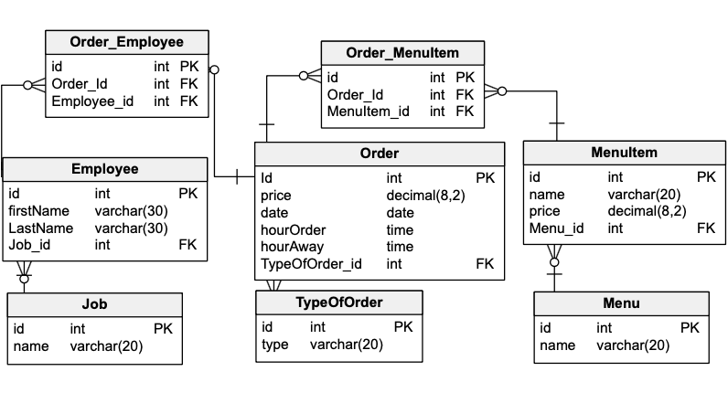

# Restaurant Management System
> Project is REST API based on CRUD methods. Project was written in Java and Spring. Project of database was created with using best practices. Database was implemented in MySql. Restaurant gives us opportunity to manage menu, orders and employees. It gives us possibility to get some stats about restaurant and managing all staff. App was written with Clean Code and OOP programming practice. Unit and integration tests were code using JUnit and Mockito.


## Table of Contents
* [General Info](#general-information)
* [Technologies Used](#technologies-used)
* [Run and Test](#run-and-test)
* [Endpoints](#endpoints)
* [Database](#database)
* [Screenshots](#screenshots)
* [Project Status](#project-status)
* [Room for Improvement](#room-for-improvement)
* [Contact](#contact)


## General Information
- Restaurant management system gives us opportunity to adding, modifying, deleting menu items. There is a possibility to manage employees as Cooks, Delievers and Waiters. Also we can adding two types of orders: delivery and on-site. We got a real-time working kitchen, where it is used multi-threading to making food. Everything is saved in relational database.
- Project goal is improvement my programming skills and show my ability to write good quality code.
- Project with similiar requirements, On my GUI classes, I have to do project with similar requirements (https://github.com/KubaTworek/Restaurant-Management) but I decided to build it also as WebApp in Java with using some frameworks.


## Technologies Used
- Java
- SpringBoot
- Hibernate
- MySQL, JSON
- REST API, Postman
- 

## Run and Test

To run the application type

```
mvn spring-boot:run
```

To execute unit and acceptance tests

```
mvn test
```

## Endpoints

This API provides HTTP endpoint's and tools for the following:

# Employee
* Create an employee: `POST/employees/{jobName}`
* Delete an employee (by id): `DELETE/employees/{employeeId}`
* Find every employee in restaurant: `GET/employees`
* Find unique employee in restaurant (by id): `GET/employees/{employeeId}`
* Find employees in restaurant (by job name): `GET/employees/{jobName}`

Request Body [Employee]
```
{
     "firstName": varchar(20),
     "lastName": varchar(20),
     "job": {
        "id": Long,
        "name": varchar(20)
     }
}
```

# Menu
* Create a menu: `POST/menu`
* Create a menu item and add to menu (by menu name): `POST/menu-items/{menuName}`
* Delete a menu (by id): `DELETE/menu/{menuId}`
* Delete a menu item (by id): `DELETE/menu-items/{menuItemId}`
* Find every menu in restaurant: `GET/menu`
* Find unique menu in restaurant (by id): `GET/menu/{menuId}`
* Find unique menu item in restaurant (by id): `GET/menu-items/{menuItemId}`
* Find menu in restaurant (by menu name): `GET/menu/{menuName}`

Request Body [Menu]
```
{
     "name": varchar(20),
}
```

Request Body [Menu-Item]
```
{
     "name": varchar(20),
     "price": double,
     "menu": {
        "id": Long,
        "name": varchar(20)
     }
}
```

# Order
* Create an order with type of order: `POST/orders/{typeOfOrder}`
* Delete an order (by id): `DELETE/orders/{orderId}`
* Find every order in restaurant: `GET/orders`
* Find unique order in restaurant (by id): `GET/orders/{orderId}`
* Find orders in restaurant (by date): `GET/orders/date/{date}`
* Find orders in restaurant (by type of order): `GET/orders/type-of-order/{typeOfOrder}`
* Find orders in restaurant (by employee id): `GET/orders/employee/{employeeId}`
* Find made orders in restaurant: `GET/orders/ready`
* Find unmade orders in restaurant: `GET/orders/unready`
  
Request Body [Order]
```
{
     "typeOfOrder": {
        "id": Long,
        "name": varchar(20)
     },
      "menuItems": [
    {
        "id": Long
    },
    {
        "id": Long
    },
    {
        "id": Long
    }
}
```


## Database

<!-- If you have screenshots you'd like to share, include them here. -->
  
  
## Screenshots

<!-- If you have screenshots you'd like to share, include them here. -->


## Project Status
Project is: _in_progress_


## Room for Improvement

Room for improvement:
- Add frontend build in Angular

To do:
- add daily income
- add possibility of refusing to take order by client
- add tips
- add priority to on-site orders


## Contact
Created by me :)